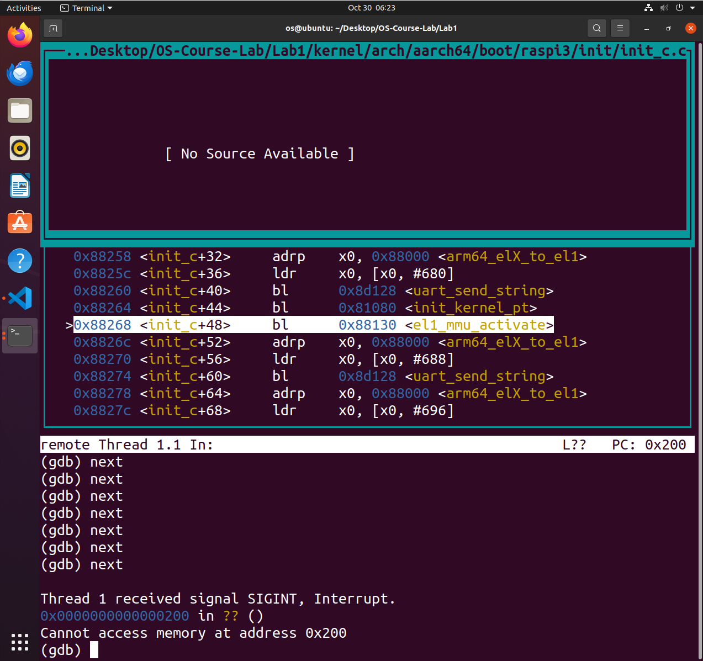

# Report of Lab1

王焕宇 522030910212

---

### 思考题 1
阅读 _start 函数的开头，尝试说明 ChCore 是如何让其中一个核首先进入初始化流程，并让其他核暂停执行的。

---

mpidr_el1寄存器提供了关于处理器在其物理和逻辑位置配置中的位置信息，其中的最低8位确定了核心在CPU中的序号。_start函数开头在x8中保存mpidr_el1，并通过和0xFF与运算得到最低八位：
- x8 == 0：则为第一个核心，进入primary进行初始化流程
- x8 != 0：则为其他核心，运行到wait_until_smp_enabled函数后开始循环，等待后续初始化(secondary_init_c)

---

### 练习题 2
在 arm64_elX_to_el1 函数的 LAB 1 TODO 1 处填写一行汇编代码，获取 CPU 当前异常级别。

---

```
mrs x9, CurrentEL
```
CurrentEL[2:3]位，00-11分别代表EL0-EL3，此时x9=0xC，代表处于EL3

---

### 练习题 3
在 arm64_elX_to_el1 函数的 LAB 1 TODO 2 处填写大约 4 行汇编代码，设置从 EL3 跳转到 EL1 所需的 elr_el3 和 spsr_el3 寄存器值。

---

```
adr x9, .Ltarget
msr elr_el3, x9
mov x9, SPSR_ELX_DAIF | SPSR_ELX_EL1H
msr spsr_el3, x9
```
.Ltarget存储在elr_el3，使得函数能够正确返回_start，spsr_el3设置为(0b1111 << 6) | (0b0101)，分别对应此寄存器中屏蔽中断和设置SP

---

### 思考题 4
说明为什么要在进入 C 函数之前设置启动栈。如果不设置，会发生什么？

---

C函数的调用期间，参数、返回值、需保存的变量等都需要通过栈来传递，因此在进入C函数前需要开栈，否则上述值无法在函数调用中传递和保存。

---

### 思考题 5
在实验 1 中，其实不调用 clear_bss 也不影响内核的执行，请思考不清理 .bss 段在之后的何种情况下会导致内核无法工作。

---

.bss段存放未初始化的全局变量，如果不手动清零，其中的值是随机的，如果程序非法访问这些未初始化的变量，会得到不确定的结果，可能影响程序正确运行，因此最好全部清理。

---

### 练习题 6
在 kernel/arch/aarch64/boot/raspi3/peripherals/uart.c 中 LAB 1 TODO 3 处实现通过 UART 输出字符串的逻辑。

---

```c
for (int i = 0; str[i] != '\0'; ++i) {
    early_uart_send(str[i]);
}
```
遍历str中每个字符，通过early_uart_send函数打印

---

### 练习题 7
在 kernel/arch/aarch64/boot/raspi3/init/tools.S 中 LAB 1 TODO 4 处填写一行汇编代码，以启用 MMU。

---

```
orr		x8, x8, #SCTLR_EL1_M
```
修改sctlr_el1寄存器中第M位，打开MMU

---

### 思考题 8
请思考多级页表相比单级页表带来的优势和劣势（如果有的话），并计算在 AArch64 页表中分别以 4KB 粒度和 2MB 粒度映射 0～4GB 地址范围所需的物理内存大小（或页表页数量）。

---

- 优势：多级页表能有效压缩页表的大小，符合程序虚拟地址空间分配稀疏的现状，且支持大页。
- 劣势：多级页表使得OS更加复杂，且某些情况下占用空间较多，寻址访存次数变多导致速度慢。
- 4KB粒度：4GB共需要1024*1024个4KB页，且4KB页能存512项64位地址，则三级页表要2048个，二级页表要4个，一级页表和零级页表各1个。页表总占用2054个4KB页
- 2MB粒度：4GB共需要2048个2MB页，则二级页表要4个，一级页表和零级页表各1个。页表总占用6个4KB页

---

### 思考题 9
请结合上述地址翻译规则，计算在练习题 10 中，你需要映射几个 L2 页表条目，几个 L1 页表条目，几个 L0 页表条目。页表页需要占用多少物理内存？

---

练习题10中映射地址为0x00000000-0x40000000，以2MB粒度映射，共有512个2MB页，则二级页表，一级页表，零级页表各1个，页表总占用3*4KB。

---

### 练习题 10
在 init_kernel_pt 函数的 LAB 1 TODO 5 处配置内核高地址页表（boot_ttbr1_l0、boot_ttbr1_l1 和 boot_ttbr1_l2），以 2MB 粒度映射。

---

```c
/* LAB 1 TODO 5 BEGIN */
/* Step 1: set L0 and L1 page table entry */
/* BLANK BEGIN */
vaddr = KERNEL_VADDR;
boot_ttbr1_l0[GET_L0_INDEX(vaddr)] = ((u64)boot_ttbr1_l1) | IS_TABLE
                                        | IS_VALID | NG;
boot_ttbr1_l1[GET_L1_INDEX(vaddr)] = ((u64)boot_ttbr1_l2) | IS_TABLE
                                        | IS_VALID | NG;
/* BLANK END */

/* Step 2: map PHYSMEM_START ~ PERIPHERAL_BASE with 2MB granularity */
/* BLANK BEGIN */
for (; vaddr < KERNEL_VADDR + PERIPHERAL_BASE; vaddr += SIZE_2M) {
        boot_ttbr1_l2[GET_L2_INDEX(vaddr)] =
                (vaddr - KERNEL_VADDR) /* high mem, va - kva = pa */
                | UXN /* Unprivileged execute never */
                | ACCESSED /* Set access flag */
                | NG /* Mark as not global */
                | INNER_SHARABLE /* Sharebility */
                | NORMAL_MEMORY /* Normal memory */
                | IS_VALID;
}
/* BLANK END */

/* Step 2: map PERIPHERAL_BASE ~ PHYSMEM_END with 2MB granularity */
/* BLANK BEGIN */
for (vaddr = KERNEL_VADDR + PERIPHERAL_BASE; vaddr < KERNEL_VADDR + PHYSMEM_END; vaddr += SIZE_2M) {
        boot_ttbr1_l2[GET_L2_INDEX(vaddr)] =
                (vaddr - KERNEL_VADDR) /* high mem, va - kva = pa */
                | UXN /* Unprivileged execute never */
                | ACCESSED /* Set access flag */
                | NG /* Mark as not global */
                | DEVICE_MEMORY /* Device memory */
                | IS_VALID;
}
/* BLANK END */
/* LAB 1 TODO 5 END */
```
仿照ttbr0的映射，只是在每次映射时候加上KERNEL_VADDR偏移量。

### 思考题 11
请思考在 init_kernel_pt 函数中为什么还要为低地址配置页表，并尝试验证自己的解释。

---

因为el1_mmu_activate函数中设置sctlr_el1后，MMU已经启动，但是下一条指令仍位于低地址空间，使得chcore无法继续初始化，因此也要映射低地址部分。

验证：注释掉低地址映射部分后，单步执行到uart_send_string("[BOOT] Enable el1 MMU\r\n")时无响应，终止后发现程序无法读取0x200地址的内存。


---

### 思考题 12
在一开始我们暂停了三个其他核心的执行，根据现有代码简要说明它们什么时候会恢复执行。思考为什么一开始只让 0 号核心执行初始化流程？

---

从代码来看，init_c函数初始化uart后，调用wakeup_other_cores()，设置其他核心的entry address，并通过sev恢复其余核心的初始化。

最开始只让0号核心初始化可以减少多核并行产生的串口冲突，简化启动过程，且0号核心启动后能够使后续启动更加稳定可控。